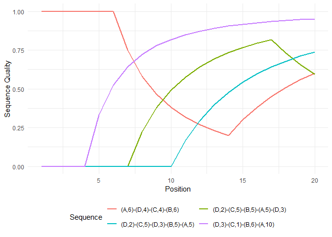

Sequence Quality Index
================


**[Marcel Raab](https://marcelraab.de/)**

R/seqquality is an [R](https://www.r-project.org) package comprising
only a single function which computes a generalized version of the
sequence quality index proposed by *Manzoni and Mooi-Reci (2018)*. The
index is defined as


where  indicates the
position within the sequence and
 the total length of the
sequence.  is a
weighting factor simultaneously affecting how strong the index reacts to
(and recovers from) a change in state quality.
 is a
weighting factor denoting the quality of a state at position
. The function
normalizes  to have values between 0 and 1. Therefore,
. If no quality vector is specified, the first state of the
alphabet is coded 0, whereas the last state is coded 1. For the states
in-between each step up the hierarchy increases the value of the vector
by
, with
 indicating
the length of the alphabet. This procedure was borrowed from the
`seqprecstart`, a helper function used for the implementation of the
sequence precarity index proposed by *Ritschard et al. (2018)*.

The package can be installed using `install_github` from the `devtools`
package:

``` r
install.packages("devtools")
library(devtools)
install_github("maraab23/seqquality")
library(seqquality)
```

## Examples

First, you need to load additional libraries and data to run the
examples.

``` r
library(tidyverse)
library(TraMineR)

data(actcal)
# Define state sequence object
actcal.seq <- seqdef(actcal[,13:24])
```

We use the `actcal` example data that come with the `TraMineR`package.
This dataset comprises 2000 individual sequences of monthly activity
statuses from January to December 2000 (type `?actcal` for getting more
details). The sequence alphabet is defined as:

  - A = Full-time paid job (\> 37 hours)
  - B = Long part-time paid job (19-36 hours)
  - C = Short part-time paid job (1-18 hours)
  - D = Unemployed (no work)

For illustration purposes we impose the following state quality
hierarchy:


The default version of the quality index with
 can be obtained
by typing:

``` r
seqquality(actcal.seq, stqual = 4:1)
```

    ## # A tibble: 2,000 x 1
    ##    `w=1`
    ##    <dbl>
    ##  1 0.667
    ##  2 0.718
    ##  3 0.667
    ##  4 0.474
    ##  5 1    
    ##  6 0.658
    ##  7 0    
    ##  8 1    
    ##  9 1    
    ## 10 1    
    ## # ... with 1,990 more rows

When `time.varying=TRUE` the index is computed for every position
 by incrementing the
length of the sequences by 1 until the full sequence length is reached.
The following command computes the time-varying quality index using
three different weighting factors
").

``` r
seqquality(actcal.seq, 
           stqual = c(4:1), 
           weight = c(.5,1,2), 
           time.varying = TRUE)
```

    ## $`w=0.5`
    ## # A tibble: 2,000 x 13
    ##    weight `t=1` `t=2` `t=3` `t=4` `t=5` `t=6` `t=7` `t=8` `t=9` `t=10` `t=11`
    ##     <dbl> <dbl> <dbl> <dbl> <dbl> <dbl> <dbl> <dbl> <dbl> <dbl>  <dbl>  <dbl>
    ##  1    0.5 0.816 0.816 0.816 0.816 0.816 0.816 0.816 0.816 0.816  0.816  0.816
    ##  2    0.5 0     0     0     0     0.267 0.433 0.544 0.623 0.682  0.726  0.762
    ##  3    0.5 0.816 0.816 0.816 0.816 0.816 0.816 0.816 0.816 0.816  0.816  0.816
    ##  4    0.5 0.577 0.577 0.577 0.577 0.577 0.577 0.577 0.577 0.577  0.611  0.637
    ##  5    0.5 1     1     1     1     1     1     1     1     1      1      1    
    ##  6    0.5 0     0.478 0.62  0.684 0.719 0.741 0.756 0.766 0.774  0.78   0.785
    ##  7    0.5 0     0     0     0     0     0     0     0     0      0      0    
    ##  8    0.5 1     1     1     1     1     1     1     1     1      1      1    
    ##  9    0.5 1     1     1     1     1     1     1     1     1      1      1    
    ## 10    0.5 1     1     1     1     1     1     1     1     1      1      1    
    ## # ... with 1,990 more rows, and 1 more variable: `t=12` <dbl>
    ## 
    ## $`w=1`
    ## # A tibble: 2,000 x 13
    ##    weight `t=1` `t=2` `t=3` `t=4` `t=5` `t=6` `t=7` `t=8` `t=9` `t=10` `t=11`
    ##     <dbl> <dbl> <dbl> <dbl> <dbl> <dbl> <dbl> <dbl> <dbl> <dbl>  <dbl>  <dbl>
    ##  1      1 0.667 0.667 0.667 0.667 0.667 0.667 0.667 0.667 0.667  0.667  0.667
    ##  2      1 0     0     0     0     0.333 0.524 0.643 0.722 0.778  0.818  0.848
    ##  3      1 0.667 0.667 0.667 0.667 0.667 0.667 0.667 0.667 0.667  0.667  0.667
    ##  4      1 0.333 0.333 0.333 0.333 0.333 0.333 0.333 0.333 0.333  0.394  0.439
    ##  5      1 1     1     1     1     1     1     1     1     1      1      1    
    ##  6      1 0     0.444 0.556 0.6   0.622 0.635 0.643 0.648 0.652  0.655  0.657
    ##  7      1 0     0     0     0     0     0     0     0     0      0      0    
    ##  8      1 1     1     1     1     1     1     1     1     1      1      1    
    ##  9      1 1     1     1     1     1     1     1     1     1      1      1    
    ## 10      1 1     1     1     1     1     1     1     1     1      1      1    
    ## # ... with 1,990 more rows, and 1 more variable: `t=12` <dbl>
    ## 
    ## $`w=2`
    ## # A tibble: 2,000 x 13
    ##    weight `t=1` `t=2` `t=3` `t=4` `t=5` `t=6` `t=7` `t=8` `t=9` `t=10` `t=11`
    ##     <dbl> <dbl> <dbl> <dbl> <dbl> <dbl> <dbl> <dbl> <dbl> <dbl>  <dbl>  <dbl>
    ##  1      2 0.444 0.444 0.444 0.444 0.444 0.444 0.444 0.444 0.444  0.444  0.444
    ##  2      2 0     0     0     0     0.455 0.67  0.786 0.853 0.895  0.922  0.941
    ##  3      2 0.444 0.444 0.444 0.444 0.444 0.444 0.444 0.444 0.444  0.444  0.444
    ##  4      2 0.111 0.111 0.111 0.111 0.111 0.111 0.111 0.111 0.111  0.198  0.257
    ##  5      2 1     1     1     1     1     1     1     1     1      1      1    
    ##  6      2 0     0.356 0.413 0.43  0.436 0.44  0.441 0.442 0.443  0.443  0.444
    ##  7      2 0     0     0     0     0     0     0     0     0      0      0    
    ##  8      2 1     1     1     1     1     1     1     1     1      1      1    
    ##  9      2 1     1     1     1     1     1     1     1     1      1      1    
    ## 10      2 1     1     1     1     1     1     1     1     1      1      1    
    ## # ... with 1,990 more rows, and 1 more variable: `t=12` <dbl>

Finally, we present an example illustrating how to implement the
original binary sequence quality index. For this purpose we create
example data containing four sequences and four states. Only the last
two states of the alphabet (A & B) are considered as success (`stqual =
c(0,0,1,1)`).

``` r
# Generate example data
data <- matrix(c(c(rep("D", 3), rep("C", 1), rep("B", 6), rep("A", 10)),
                 c(rep("A", 6), rep("D", 4), rep("C", 4), rep("B", 6)),
                 c(rep("D", 2), rep("C", 5), rep("D", 3), rep("B", 5), rep("A", 5)),
                 c(rep("D", 2), rep("C", 5), rep("B", 5), rep("A", 5), rep("D", 3))), nrow = 4, byrow = TRUE)
```

``` r
# Generate state sequence object
example.seq <- seqdef(data, alphabet = c("D","C","B","A"))
```

``` r
# Save print-friendly version of sequences for graph legend
example.sps <- print(example.seq, format = "SPS")
```

    ##     Sequence                     
    ## [1] (D,3)-(C,1)-(B,6)-(A,10)     
    ## [2] (A,6)-(D,4)-(C,4)-(B,6)      
    ## [3] (D,2)-(C,5)-(D,3)-(B,5)-(A,5)
    ## [4] (D,2)-(C,5)-(B,5)-(A,5)-(D,3)

``` r
# Compute time-varying quality index using a binary definition of  quality
qual.binary.tvar <- seqquality(example.seq,
                               stqual = c(0,0,1,1),
                               time.varying = TRUE)
```

Following the example of *Manzoni and Mooi-Reci (2018)*, we proceed by
visualizing how the sequence quality index develops across the positions
of the sequences:

``` r
# Preparing the data for ggplot (-> long format)
fig.data <- qual.binary.tvar %>%
  mutate(Sequence = example.sps) %>%
  select(-weight) %>%
  pivot_longer(-Sequence, 
               names_to = "Position",
               values_to = "Sequence Quality") %>%
  mutate(Position = as.numeric(substring(Position, first = 3)))

# Plot the development of the sequence quality index
fig.data %>%
  ggplot(aes(x = Position, 
             y = `Sequence Quality`, 
             color = Sequence)) +
  geom_line(size=1) +
  theme_minimal() +
  theme(legend.position="bottom") +
  guides(col=guide_legend(nrow=2,byrow=TRUE)) 
```

<!-- -->

## References

Manzoni, A., & Mooi-Reci, I. (2018). *Measuring Sequence Quality*. In G.
Ritschard & M. Studer (Eds.), Sequence Analysis and Related Approaches
(pp. 261–278). doi: 10.1007/978-3-319-95420-2\_15

Ritschard, G., Bussi, M., & O’Reilly, J. (2018). *An Index of Precarity
for Measuring Early Employment Insecurity*. In G. Ritschard & M. Studer
(Eds.), Sequence Analysis and Related Approaches (pp. 279–295). doi:
10.1007/978-3-319-95420-2\_16
